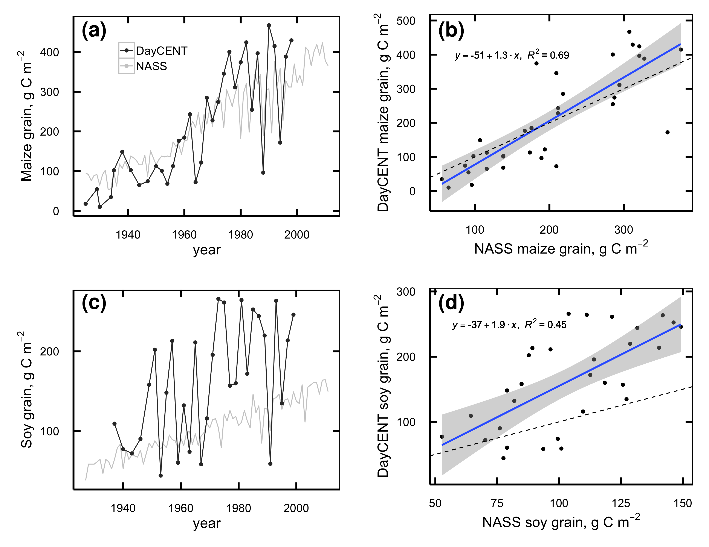
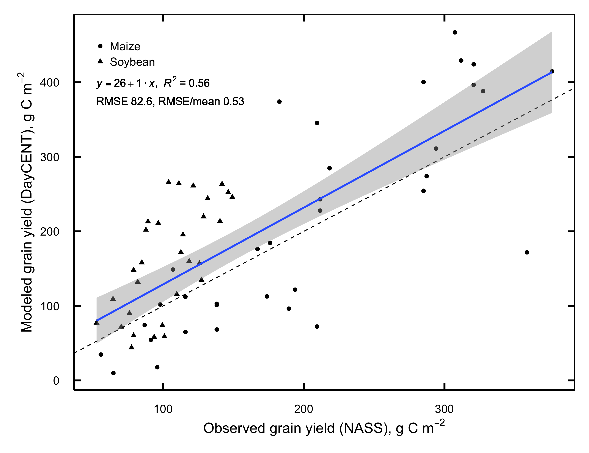
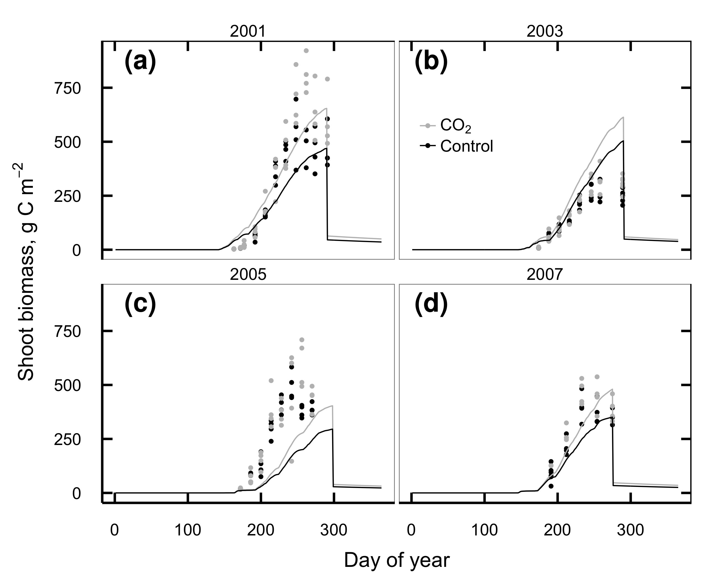

*****

# {label="&#50;.S"}

## Supplement 2.S1: DayCent model fit evaluation

### Data availability

All the data for this paper, including raw files, data-processing scripts, and DayCent simulation files, is permanantly archived in Dryad (http://datadryad.org) and is freely available online: http://dx.doi.org/10.5061/dryad.bn7j3.

Additionally, the DayCent model files, raw output, run management scripts and the majority of the model calibration data are available online at https://github.com/infotroph/soyface_daycent. Some validation was performed against unpublished datasets that were shared by collaborators in advance of publication; these are not available in this project's archive, but we intend to update the Github repository with links to those datasets at such time as their authors make them available.

*****

Table: Summary of model parameters changed between phases of the DayCent model run. {#tbl:modparams}

| File | Parameter | Spin-up value | Ag value| FACE value | Remarks |
|------|-----------|--------------|--------------|----------|----|
| sitepar.in | watertable[1-5] | 1 | 0 | 0 | Tile drainage lowers Jan-May water table |
| sitepar.in | netm\_to\_no3 | 0.05 | 0.8 | 0.8 | Nitrification much lower in undisturbed grassland |
| fix.100 | CO2PPM(1)| 294 | 294 | 370 | Starting [CO~2~] |
| fix.100 | CO2PPM(2)| 294 | 370 | 570 | Ending [CO~2~] |
| fix.100 | CO2RMP | 1 | 1 | 0 | 0=step change in given year, 1=ramp |
| fix.100 | DEC4 | 0.002 | 0.0025 | 0.0025 | Slow-turnover OM decomposes faster in tilled, drained soil |
| fix.100 | DEC5(1) | 0.08 | 0.2 | 0.2 | Intermediate-turnover OM at surface decomposes faster in tilled, drained soil |
| fix.100 | DEC5(2) | 0.1 | 0.25 | 0.25 | Intermediate-turnover OM below surface decomposes faster in tilled, drained soil |
| fix.100 | FLEACH(1) | 0.7 | 0.4 | 0.4 | Intercept for mineral leaching as a function of sand content |
| fix.100 | FLEACH(2) | 0.9 | 0.4 | 0.4 | Slope for mineral leaching as a function of sand content |
| fix.100 | FLEACH(3) | 0.95 | 0.2 | 0.2 | Leaching fraction multiplier for leached mineral N |
| fix.100 |MINLCH | 1.5 | 1.0 | 1.0 | Minimum cm water flow to activate mineral leaching |
| fix.100 | OMLECH(1) | 0.03 | 0.05| 0.05 |Intercept for organic matter leaching as a function of sand content |
| fix.100 | OMLECH(2) | 0.12 | 0.15 | 0.15 | Slope for organic matter leaching as a function of sand content |
| fix.100 | OMLECH(3) | 1.9 | 0.1 | 0.1 | Minimum cm water flow to activate organic leaching |
| soyface.100 | EPNFS(2) | 0.017 | 0.005 | 0.005 | Slope for nonsymbiotic N fixation as a function of annual precipitation |

*****

Table: Summary of management schedule for DayCent simulations. {#tbl:modschedules}

| Years | Crop | Weather^1^ | Tillage^2^ | N management^3^ |
|:------|:-----|:-----------|:-----------|:----------------|
| -2000–1868 | Prairie |R| Fire every 5th year | Graze May–July |
| 1869–1888 | 2 yr maize 1, oat, 2 yr pasture | R | Spring MD before maize & oat, fall M | Graze May–Oct after oats and during pasture |
| 1889–1934 | 2 yr maize 1, oat, 2 yr pasture | H | Spring MD before maize & oat, fall M | Graze May–Oct after oats and during pasture |
| 1935–1949 | Maize 3, oat, low yield soy | H | Spring MD, fall M | Fert 40.4, graze after oats |
| 1950–1959 | Maize 5, medium yield soy | H | Spring MD, fall M | Fert 56 |
| 1960–1969 | Maize 7, medium yield soy | H | Spring MD, fall M | Fert 100 |
| 1970–1979 | Maize 9, medium yield soy | H | Spring CD, fall C after maize | Fert 157 |
| 1980–1998 | Maize 10, high yield soy | H | Spring CD, fall C after maize | Fert 157|
| 1999–2000 | High yield soy, winter wheat | H | Spring CD, fall C after wheat | Fert 116.4|
| 2001-2109	| Maize 10, high yield soy | D | Spring CD, fall C after maize | Fert 157 |

^1^R = randomized weather; H = historic weather from Illinois Water Survey (4.7 km from site); D = Gridded weather for site retrieved from DAYMET.

^2^M = Moldboard plow; D = disk; C = Chisel plow.

^3^Fertilization rates are in kg N ha^-1^. Fertilizer is applied before planting of maize and wheat only; other crops are never fertilized.

*****

Table: Summary of DayCent parameters changed between simulated maize cultivars. All parameters not shown here are identical between cultivars; see CROP.100 in the model files for details. {#tbl:modmaize}

|     Parameter|C1^1^|   C3|   C5|   C7|   C9|  C10|
|:-------------|----:|----:|----:|----:|----:|----:|
|       PRDX(1)| 0.30| 0.45| 0.70| 0.75| 1.00| 1.50|
|       FRTC(5)| 0.10| 0.10| 0.10| 0.20| 0.20| 0.20|
|  CFRTCN(1)^2^| 0.40| 0.40| 0.40| 0.30| 0.30| 0.30|
|    PRAMN(1,1)|   20|   20|   10|   10|   10|   10|
|    PRAMX(1,1)|   40|   40|   20|   20|   20|   20|
|         HIMAX| 0.35| 0.40| 0.50| 0.60| 0.60| 0.60|
|     EFRGRN(1)| 0.50| 0.75| 0.75| 0.75| 0.75| 0.75|
|        FALLRT| 0.10| 0.10| 0.10| 0.10| 0.20| 0.20|
|    TMPGERM^2^|   10|   10|   10|   15|   15|   15|
|     DDBASE^2^| 1500| 1500| 1700| 1450| 1450| 1450|
|    TMPKILL^2^|    7|    7|   12|   14|   14|   14|

^1^These cultivar names come from a set of 11 developed by Hudiburg et al. [-@Hudiburg:2014gv]; C2, C4, C6, C8, C11 are not shown here because they were not used in the current simulations.

^2^These parameters are ignored by DayCent when FRTINDX==2, as it is for all of these cultivars, and are included here only for completeness.

*****

{#fig:modsomtarg}

*****

{#fig:modmassnass}

*****

{#fig:modmassnassboth}

*****

{#fig:modmasstf}

*****

{#fig:modresptf}

