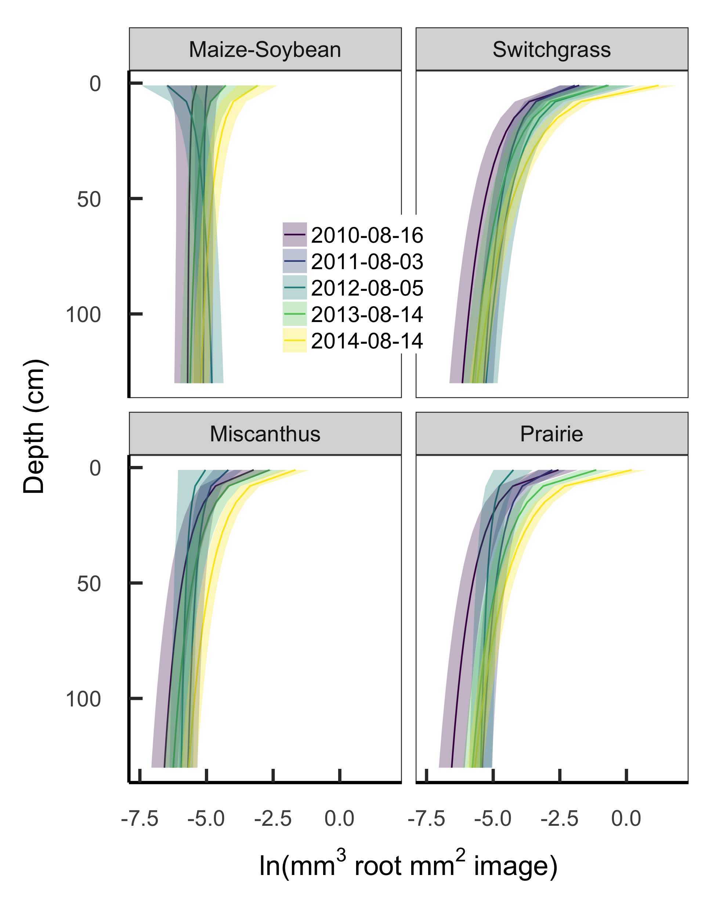
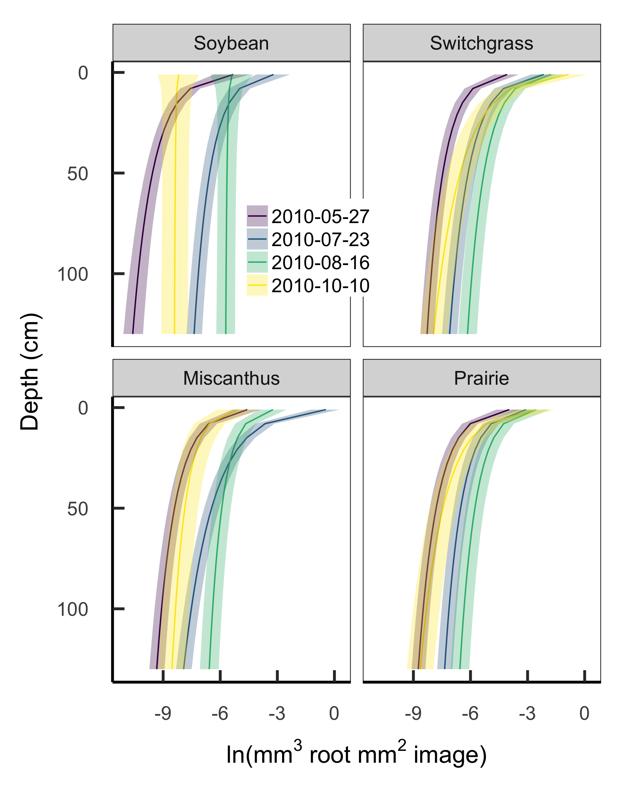
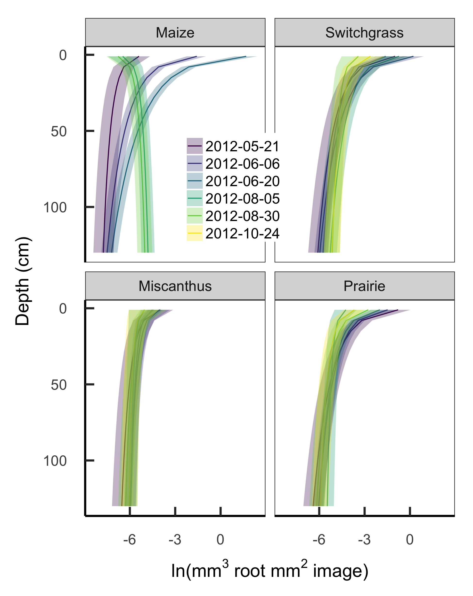

***

## Figures

![Biomass in roots and rhizomes of biofuel crops, as measured by coring in 2011 and again in 2014, divided by depth horizon. Error bars show mean ± 1 standard error of total profile biomass in each block. The 2011 data are re-plotted from [@AndersonTeixeira:2013bx].](figures/coremass.png){#fig:coremass}

***

![Depth profiles of root and root+rhizome mass measured by deep coring in 2011 (left) and again in 2014 (right). The 2011 data are replotted from [@AndersonTeixeira:2013bx].](figures/coreprofile.png){#fig:coreprofile}

***

{#fig:stanpeak}

***

{#fig:stan2010}

***

{#fig:stan2012}

***
